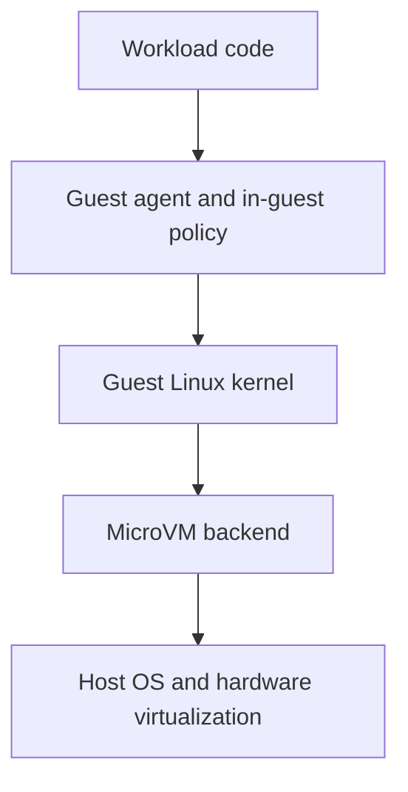
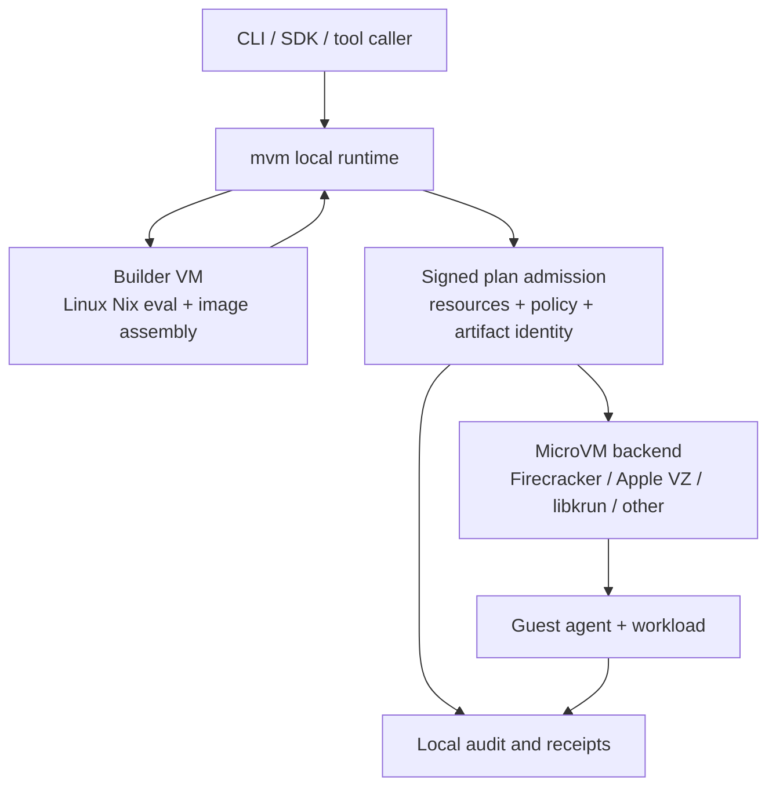

Infrastructure teams increasingly need to run code they did not write.

That code may be a user-submitted script, an AI-generated tool call, a dependency install hook, a CI job, a data-processing task, or a small service that needs to run near sensitive files and credentials. The old answer was often "put it in a container." Containers are useful, fast, and familiar, but they were not designed to be the final security boundary for hostile workloads.

`mvm` is built around a different assumption: if code might be untrusted, generated, or simply surprising, the isolation boundary should be obvious and strong by default.

The two core technologies behind that posture are:

- **microVMs**, which give each workload its own small virtual machine boundary; and
- **Nix**, which makes the software inside that boundary reproducible, pinned, and auditable.

This post is a high-level tour of why those pieces matter and how `mvm` combines them. It avoids deep implementation detail on purpose. The goal is to explain the shape of the system before diving into kernel command lines, seccomp profiles, vsock protocols, or Nix derivations.

## What mvm is optimizing for

Before talking about the stack, it helps to name the product requirements.

`mvm` is a local and programmable runtime for running Linux workloads in secure sandboxes. That includes development environments, AI agent sandboxes, code interpreters, CI-style jobs, and service experiments. The security model has to be practical enough for everyday use, but strong enough that "run this code" does not mean "trust this code with the host."

The important requirements are:

- **Strong isolation**: workload code should not be able to freely access the host filesystem, host credentials, or neighboring workloads.
- **Clear boundaries**: build work, launch decisions, guest control, network access, secrets, and audit records should each have a named place in the architecture.
- **Reproducible inputs**: the image that boots should come from pinned, inspectable inputs rather than mutable snowflake setup steps.
- **Fast iteration**: developers still need the experience to feel lightweight. A stronger boundary is not useful if nobody uses it.
- **Portable intent**: the same workload definition should describe what to run, what it needs, and what policies apply, even when the backend differs by platform.

MicroVMs and Nix map neatly onto these goals.

## Why microVMs

A microVM is a small virtual machine designed for fast startup and low overhead. It is still a VM: it has a guest kernel, a guest filesystem, virtual devices, and a hypervisor boundary beneath it. The "micro" part means the device model and runtime surface are intentionally smaller than a general-purpose virtual machine.

That distinction matters for security.

Containers share the host kernel. A container can be locked down with namespaces, cgroups, seccomp, capabilities, and filesystem policy, and those controls are valuable. But if the workload finds a path through the host kernel or container runtime, the boundary can collapse.

A microVM puts a guest kernel between the workload and the host. The workload can still attack its own guest environment, but reaching the host requires crossing the virtualization boundary too.

At a high level, `mvm` thinks about the runtime like this:

Each layer narrows the blast radius of a mistake in the layer above it. A bug in application code should not imply host file access. A compromised process inside the guest should not imply control of the host. A broad tool call should still pass through policy and audit surfaces.

For `mvm`, the most important benefits are:

- **Kernel separation**: the workload runs on a guest Linux kernel rather than directly on the host kernel.
- **Smaller device surface**: microVM backends expose a smaller set of virtual devices than a traditional full VM.
- **One workload per boundary**: `mvm` treats the VM as the sandbox, not as a shared server for mutually distrusting tenants.
- **Backend-visible tiers**: when the selected backend cannot provide the same isolation properties, `mvm` names that difference instead of silently pretending all runtimes are equivalent.

This is why `mvm` distinguishes microVM-capable backends from convenience fallbacks. Docker can be useful for local compatibility, but it is not the same security boundary as a microVM.

## Why Nix

Isolation answers "where does this code run?" Nix helps answer "what exactly is running?"

That second question is just as important. A sandboxed workload is harder to reason about if its image was assembled from mutable package repositories, unpinned install scripts, or manual shell history. Security is not only about the runtime boundary. It is also about the supply chain that produced the thing crossing that boundary.

Nix gives `mvm` three high-level advantages:

- **Pinned inputs**: a `flake.lock` records exact dependency revisions, so rebuilds do not silently drift because an upstream package changed.
- **Repeatable image construction**: the guest image is built from a declarative definition rather than a hand-mutated machine.
- **Auditable closures**: the files and packages that enter the VM image are explicit build outputs, which makes provenance and review more practical.

For developers, this means the workload definition can stay close to the code. A flake can say which packages, services, health checks, and files the guest needs. `mvm` can then build a Linux image from that definition and boot it in a microVM.

The result is a cleaner chain:

The important part is not that every user becomes a Nix expert. The important part is that `mvm` can treat the workload image as a known artifact, not an informal pile of setup steps.

## The stack behind mvm

`mvm` separates build-time concerns from runtime concerns.

On macOS and Linux, the host process owns the local control plane: CLI parsing, SDK calls, config loading, cache lookup, and lifecycle commands. Linux image construction happens behind a builder boundary. Runtime execution happens in a separate microVM boundary.

At a high level:

The key design choice is that these are not all one big privileged operation.

- The **builder VM** handles Linux Nix evaluation, builds, and image assembly.
- The **runtime supervisor** admits launches, selects the backend, wires guest communication, and records local evidence.
- The **microVM backend** creates the isolated execution boundary.
- The **guest agent** handles controlled in-guest actions such as process execution, filesystem operations, readiness, and telemetry.
- The **policy and audit surfaces** make high-value decisions visible after the fact.

This separation is useful operationally, but it is also useful for security. If something goes wrong, you can ask which boundary was involved: build, admission, backend launch, guest control, network policy, secret release, or audit.

## How mvm uses microVMs for security

`mvm` uses microVMs as the default mental model for untrusted execution: one workload gets one narrow guest boundary.

That gives the system a stronger baseline than a shared userspace sandbox. The workload sees a Linux environment, but it does not get the host filesystem unless access is explicitly shared. The guest can have its own process tree, filesystem view, network policy, and service lifecycle. The host remains outside the normal execution environment.

`mvm` then layers additional controls around that boundary:

- **Admission before launch**: a run is admitted through an execution plan that binds artifact identity, resources, policies, validity, and replay handling.
- **Guest protocol instead of broad access**: host operations should go through controlled guest RPC rather than unconstrained shell access.
- **Explicit network and filesystem policy**: access should be declared and mediated, not implied by convenience.
- **Backend tiering**: stronger and weaker backends are named so users know which security claims apply.
- **Audit evidence**: important actions produce records that can be inspected later.

The point is not that a microVM magically solves every security problem. The point is that it gives `mvm` a hardware-backed boundary to compose with policy, reproducible builds, and evidence.

## How mvm uses Nix for security

`mvm` uses Nix to make VM images more predictable.

When a workload is described by a flake, the dependencies are pinned and the build result is an artifact. That artifact can be cached, identified, signed into a launch plan, and reused. The host does not need to rely on an interactive "I installed some packages earlier" state to understand what will boot.

This helps in several practical ways:

- **Fewer hidden dependencies**: packages enter the image through the build definition.
- **Less drift**: lock files make rebuilds stable until inputs are intentionally updated.
- **Cleaner reviews**: infrastructure changes are visible as code changes.
- **Better incident analysis**: when something runs, there is a stronger path back to what was built and why.

`mvm` also keeps Linux image construction inside the builder VM. That matters especially on macOS: the final image is a Linux guest image, so Linux-specific build and assembly work should happen in a Linux boundary. The host remains the operator, while the builder owns the Linux build work.

## Why this combination matters

MicroVMs and Nix are useful independently. Together, they cover two sides of the same security story.

MicroVMs reduce the blast radius at runtime. Nix reduces ambiguity before runtime.

That combination lets `mvm` make a stronger promise than "we started a process somewhere." It can say:

- this workload came from pinned inputs;
- this image was built as a Linux guest artifact;
- this launch was admitted with named resources and policies;
- this code ran behind a microVM boundary when a Tier 1 or Tier 2 backend was selected;
- important decisions were recorded for later inspection.

For infrastructure users who are not security specialists, that is the main idea: the system should make the secure path the normal path. You should not need to remember a long checklist every time you run a generated script, launch a tool call, or test a suspicious dependency.

## What mvm does not claim

A high-level security post should also be clear about limits.

`mvm` does not claim to defend against a malicious host. The host owns the hypervisor, local keys, and control plane. If the host is compromised, the sandbox cannot protect itself from that host.

`mvm` also does not treat every backend as equivalent. Firecracker on Linux with KVM has a different security posture than a Docker fallback. macOS virtualization backends may have different verified-boot properties than the Linux Firecracker path. The product should name those differences rather than hide them.

Finally, `mvm` does not turn Nix into a magic supply-chain shield. Pinned inputs make builds more reproducible and reviewable, but users still need to choose trustworthy dependencies and update them intentionally.

## The short version

`mvm` uses microVMs because untrusted code deserves a real isolation boundary.

It uses Nix because secure execution starts before boot, with knowing what is in the image.

It combines them with builder isolation, signed admission, explicit policy, backend tiering, guest RPC, and audit records so the secure path is not a special mode. It is the architecture.

That is the foundation. The deeper posts can go layer by layer: verified boot, vsock framing, guest-agent hardening, egress policy, secret release, and how the Nix image pipeline turns a workload definition into a bootable microVM.
